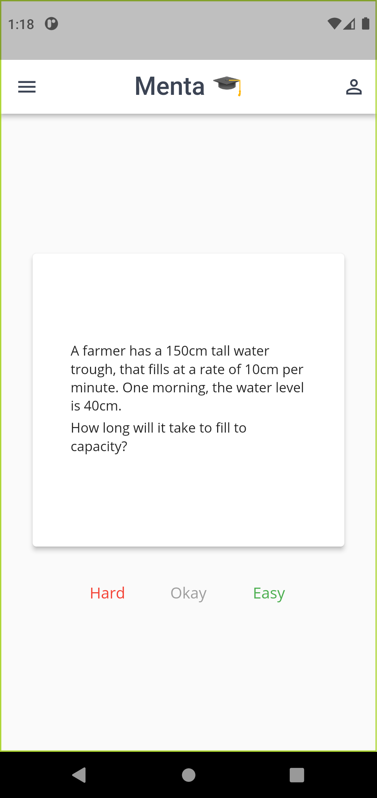
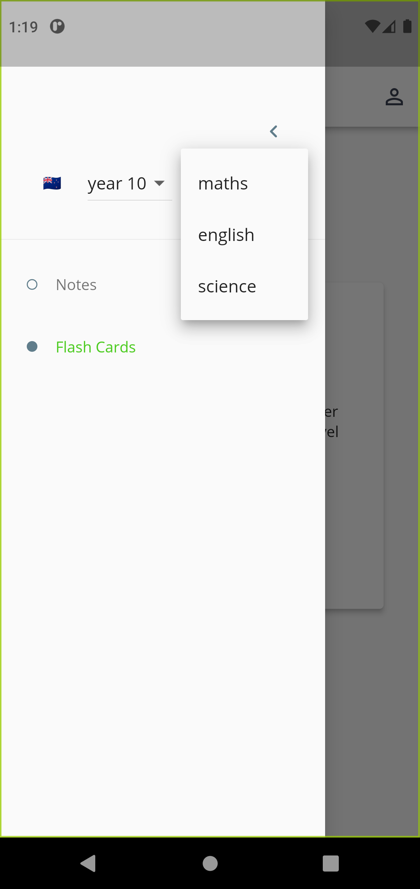
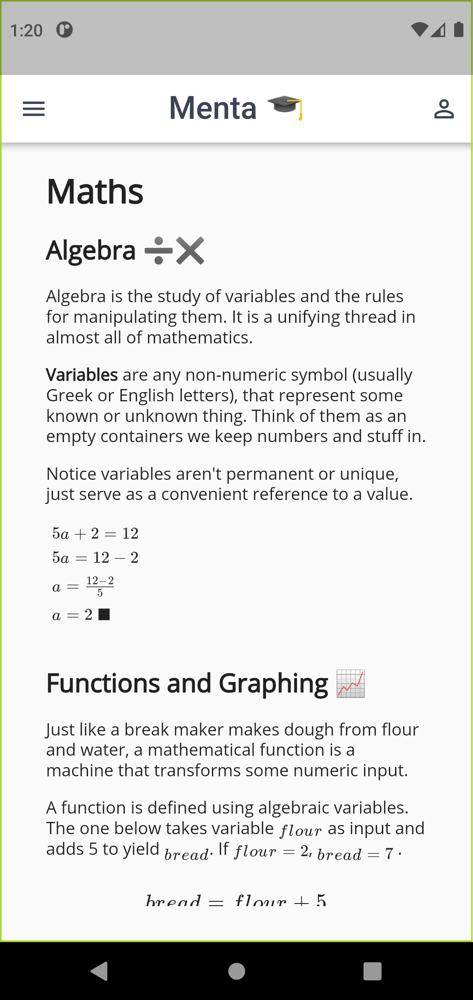

# Menta 🎓

An effective yet simple study app.  --- Entire local curriculums condensed into easy to understand notes with active recall flashcard practice, that uses a spaced repetition algorithm to maximise retention with minimal effort. 

Learn and apply concepts from past exams or fun examples, spend less time studying and ace your exams. 

<style>
	ul.row {
	  height: 200;
	  white-space: nowrap;
	}

	ul.row, li.pic {
	  margin: 20px;
	  list-style: none;
	  display: flex;
	}
</style>
<ul class="row">
    <li class='pic'></li>
    <li class='pic'></li>
    <li class='pic'></li>
</ul>

## Features 🚀

- Notes page views local markdown (with images and latex) assets with custom rendering

- Flash card shows local card assets and uses a performant spaced repetition queue 

- Optimised for web, android and ios

- Usable without internet after download and login

## Dependencies :package:

- [Flutter](https://docs.flutter.dev/get-started/install ) > 2.81
- [Android SDK](https://developer.android.com/studio/ ) > 19.0
- [NodeJS](https://nodejs.org/en/download/) > 16.0
	- ExpressJS
	- Morgan
	- Helmet
	- Mongoose
- [Python](https://www.python.org/downloads/) > 3.61

## Install & Run 🛠️ 

```bash
git clone https://github.com/MentaNZ/menta-app menta && cd menta
flutter run -d <device label> 
```

## ️️ Common Issues and FAQ :pushpin:

- Device label? What?

	Check what's installed as below, and add [mobile](https://docs.flutter.dev/get-started/install/macos#android-setup) or [web](https://docs.flutter.dev/get-started/web#set-up) devices.
	```bash
	flutter devices
	1 connected device:                                                  
																		 
	Chrome (web) • chrome • web-javascript • Google Chrome 97.0.4692.99
	```
## ️️ Upcoming Features :construction:

- [ ] Local and remote flashcard progress save
- [ ] User login and data storage

## Contact :necktie:

<ul class="row">
    <li class='pic'><a href="mailto:yohanderose@gmail.com?subject=Hello">📧 Email</a></li>
    <li class='pic'><a href="#">👨🏾 Website</a></li>
    <li class='pic'><a href="https://www.buymeacoffee.com/yderose">🍻 Donate</a></li>
</ul>
