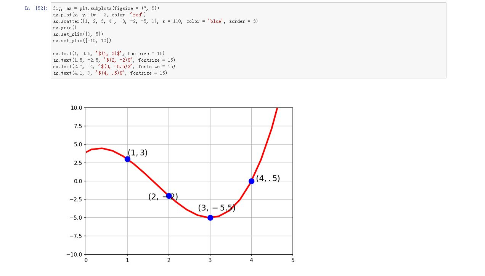
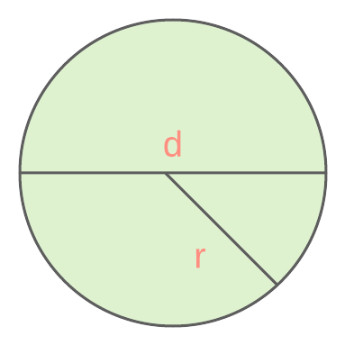
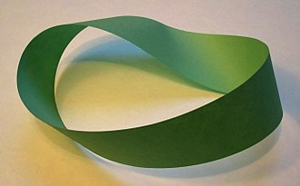

# Maths

## Algebra ➗✖️️

Algebra is the study of variables and the rules for manipulating them. It is a unifying thread in almost all of mathematics.

__Variables__ are any non-numeric symbol (usually Greek or English letters), that represent some known or unknown thing. Think of them as an empty containers we keep numbers and stuff in.

Notice variables aren't permanent or unique, just serve as a convenient reference to a value.

$5a + 2 = 12 \\
5a = 12 - 2 \\
a = \frac{12-2}{5} \\
a = 2\ \blacksquare
$

## Functions and Graphing 📈

Just like a break maker makes dough from flour and water, a mathematical function is a machine that transforms some numeric input. 

A function is defined using algebraic variables. The one below takes variable $flour$ as input and adds 5 to yield $bread$. If $flour=2$, $bread=7$ .

$$bread = flour + 5$$

The input and output variables are typically __x__ and __y__, and the same function can be expressed in different ways. The below are equivalent.

	out = in + 2
	y = x + 2
	f(x) = x + 2   [the left hand side is the result of the right]

The input to a function can be many numbers. Given many inputs, we can expect an output for each one.

	f(x) = x + 2
	f([1, 2, 3]) = [3, 4, 5]

A good way to visualise what our function does for many inputs, is to plot the inputs and outputs on the x and y axis.

## Geometry 📐

Geometry covers the size, shapes, positions and dimensions of things. In high school maths, we aren't concerned with anything higher than 3D shapes, but these ideas are often applicable in higher dimensions.

Now we get into more practical applications. Finding the area (A) of a 2D shape is a __function__ on __variables__ of that shape. 

	Say we have a circle with diameter 8 cm and radius 4 cm.

Using $A = \pi r^2$

	A = 3.14 * 16
	A = 50.24 cm² ∎

## Topology 🍩

Topology studies how spaces interact and how they are structured in terms of position.

